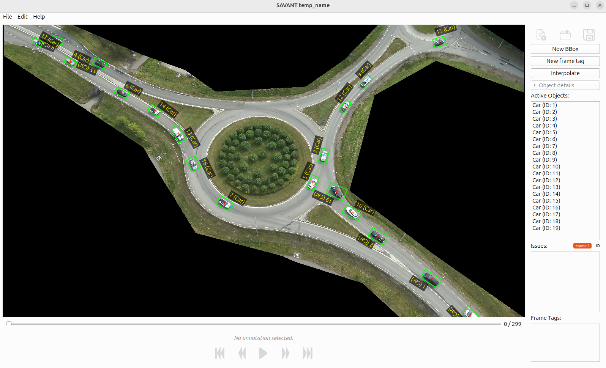

[](https://github.com/fwrise/SAVANT/actions/workflows/cd.yml)
[](https://github.com/fwrise/SAVANT/actions/workflows/ci.yml)


# SAVANT - Semi-automated video annotation toolkit
A toolkit for 2D-annotation of video with rotated bounding boxes and object tagging.
- *markit* - automated annotation (supports YOLO for object detection and classification optical flow for object detection, and AruCo detection for geotags)
- *edit* - manual annotation or corrections of pre-annotated video, and annotation quality assurance
- *trainit* - managing datasets and training object detection models

The initial use-case is aerial video annotation of traffic, supported by the use of ASAM OpenLabel output and a traffic-focused default ontology.

> [!NOTE]
> This open source project is maintained by [RISE Research Institutes of Sweden](https://ri.se/). See [LICENSE](LICENSE) file for open source license information.


## Installation

Requires Python 3.10+ and [uv](https://docs.astral.sh/uv/).

```bash
git clone git@github.com:fwrise/SAVANT.git
cd SAVANT
uv sync
```

## Repository Structure

| Directory | Description |
|-----------|-------------|
| [markit/](markit/) | Automated video annotation ([README](markit/README.md)) |
| [edit/](edit/) | Desktop application for manual label editing and quality assurance ([README](edit/README.md)) |
| [trainit/](trainit/) | YOLO training and dataset tools ([README](trainit/README.md)) |
| [utils/](utils/) | CLI utilities ([README](utils/README.md)) |
| [ontology/](ontology/) | SAVANT ontology definition ([README](ontology/README.md)) |
| [schema/](schema/) | Supported ASAM OpenLabel subset JSON schema ([README](schema/README.md)) |

## Example Workflow

1. **Capture** - Record aerial video of traffic scenario
2. **Auto-annotate** - Run `markit` to detect and track objects
3. **Review** - Use `edit` to correct annotations and verify quality
4. **Train** - Use `trainit` to fine-tune models with corrected data
5. **Iterate** - Re-run markit with improved model



## License

SAVANT is licensed under the [GNU Affero General Public License v3.0 (AGPL-3.0)](LICENSE).

## Acknowledgement
<br><div align="center">
  
</div>

This package is developed as part of the [SYNERGIES](https://synergies-ccam.eu/) project.

<br><div align="center">
  
</div>

Funded by the European Union. Views and opinions expressed are however those of the author(s) only and do not necessarily reflect those of the European Union or European Climate, Infrastructure and Environment Executive Agency (CINEA). Neither the European Union nor the granting authority can be held responsible for them.