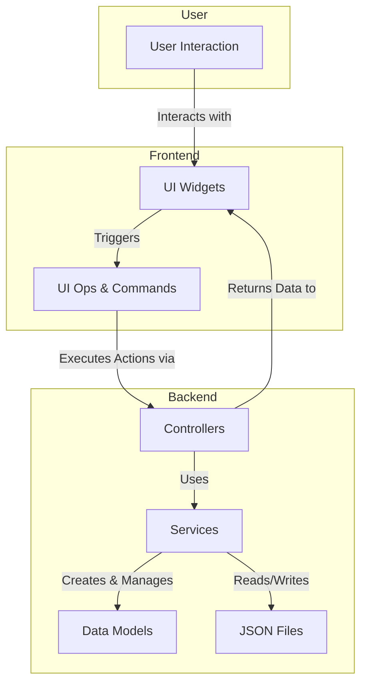

# Savant App Developer Guide

This guide is for developers who want to contribute to, maintain, or extend the Savant desktop annotator. It covers the application's architecture, development workflows, and contribution guidelines.

---

## 1. Project Setup and Tooling

### 1.1 Prerequisites
Ensure you have `uv` installed:
```bash
curl -LsSf https://astral.sh/uv/install.sh | sh
```

### 1.2 Installation
Clone the repository and install the dependencies. The `edit` application and its dependencies are defined as a dependency group in the root `pyproject.toml` file.

From the root of the SAVANT repository, run:
```bash
git clone git@github.com:fwrise/SAVANT.git
cd SAVANT
uv sync --all-groups
```
Alternatively, to install only the dependencies for the `edit` application, you can run:
```bash
uv sync --group edit
```

### 1.3 Running the Application
Once the dependencies are installed, you can run the application from the root of the repository using the following command:
```bash
uv run edit
```

### 1.4 Running Tests and Quality Checks

We use `pytest` for testing, `flake8` for linting, and `black` for code formatting. All are configured to be run via `uv` from the root of the repository.

```bash
# Run the entire pytest suite for all projects
uv run pytest

# Run tests only for the edit application
uv run pytest edit/tests/

# Run the linter
uv run flake8

# Format code
uv run black
```

---

## 2. Key Directories and Files

This guide focuses on the `edit/` directory.

```
edit/
├── README.md              # Original quick-start guide
├── USER_README.md         # Guide for end-users
├── DEV_README.md          # This guide
├── src/edit/
│   ├── main.py            # Application entry point
│   ├── controllers/       # Controller layer
│   ├── services/          # Service layer (business logic)
│   ├── models/            # Pydantic data models (OpenLabel.py)
│   ├── frontend/          # PyQt6 UI code
│   ├── global_exception_handler.py # Top-level error handling
│   └── logger_config.py   # Logging setup
└── tests/
    └── unit/              # Unit tests for services, models, etc.
```

---

## 3. Architectural Components

> **Note:** To view the diagram below in VS Code, you may need to install an extension like "Markdown Preview Mermaid Support".



-   **Controllers**: This layer acts as a bridge between the UI and the application's core logic. It ensures that user input is directed to the appropriate services.

-   **Services**: This layer contains the core business logic of Edit. It encapsulates the primary functionalities, such as managing annotations, handling video processing, and managing the application's state. The services are designed to be independent of the UI, which allows for easier testing and maintenance.

-   **Models**: The models define the data structures used throughout the application, primarily for handling data in the SAVANT OpenLabel format.

    > **Note:** Relationships in the data model are stored as individual entries. For instance, if car A tows both car B and car C, these would be two separate relationship entries rather than a single entry with an array of towed cars.

-   **Frontend**: The frontend is built with PyQt6 and is responsible for the user interface. The main components of the frontend are:
    -   **main_window.py**: This is the entry point for the UI. It initializes the main application window and brings together all the different UI components, such as the menu, video display, and sidebar.
    -   **widgets**: This directory contains all the custom UI elements used in the application. These are reusable components like the video display, playback controls, seek bar, and the sidebar, which encapsulates a significant portion of the application's interactivity.
    -   **states**: This directory manages the state of the UI. It holds data related to the frontend's current status, such as the selected theme, visibility of certain elements, and other UI-specific configurations.
    -   **utils**: This directory contains utility functions and helpers for the frontend. These can include anything from handling user input and managing settings to performing rendering operations. It is a collection of tools that support the functionality of the widgets and the main window.
        -   **ops files**: Within the `utils` directory, you'll find files with an `_ops.py` suffix, such as `annotation_ops.py` and `confidence_ops.py`. These files play a crucial role in connecting the UI to the application's core logic. They act as a dedicated layer for handling specific UI operations, encapsulating the logic required to translate user interactions into calls to the appropriate backend services. For example, `annotation_ops.py` manages everything related to creating, modifying, and deleting annotations, while `confidence_ops.py` handles the display of confidence scores. This separation of concerns helps to keep the UI components clean and focused on presentation, while the `ops` files manage the orchestration of complex UI-driven workflows.
        -   **undo**: The undo/redo functionality is built on the Command pattern and consists of several key components:
            -   **manager.py**: The `UndoRedoManager` is the core of the undo/redo functionality. It maintains two stacks: one for commands that can be undone and one for commands that can be redone.
            -   **commands.py**: This file defines the `UndoableCommand` protocol and a set of concrete command classes. Each class represents a specific user action, such as creating a bounding box or deleting a frame tag, and contains the logic to both `do` and `undo` that action.
            -   **gateways.py**: To keep the commands decoupled from the application's controllers, we use a gateway pattern. This file defines gateway protocols and functions that the commands use to interact with the backend.
            -   **snapshots.py**: These are simple data classes that capture the state of an object at a specific moment. Commands use these snapshots to save the state of the application before changes are made, so that operations can be restored during an `undo` operation.

---

## 4. Error Handling and Logging

-   A custom exception hierarchy is defined in `services/exceptions.py` to distinguish between domain errors (expected) and internal errors (unexpected).
-   The `controllers/error_handler_middleware.py` decorator wraps controller methods to catch these exceptions, log them appropriately, and ensure the UI displays a user-friendly message.
-   The `global_exception_handler.py` acts as a final safety net, catching any unhandled exceptions from the Qt event loop to prevent silent crashes.
-   Logs are configured in `logger_config.py` to output to both the console and a rotating file.

---

## 5. Contribution Workflow

1.  **Branch**: Create a new feature branch from the `main` branch.
2.  **Code**: Implement your changes, adhering to the existing architecture and coding style.
3.  **Test**: Add or update unit tests under `tests/unit` to cover your changes. Ensure all tests pass by running `uv run pytest`.
4.  **Lint & Format**: Run `uv run flake8` and `uv run black` to ensure your code meets our quality standards.
5.  **Document**: Update `USER_README.md`, this `DEV_README.md`, or other documentation if you are introducing significant changes.
6.  **Pull Request**: Open a pull request to `main`. In the description, summarize your changes, explain the "why," and list the steps you took to test your work. Include screenshots for any UI changes.
