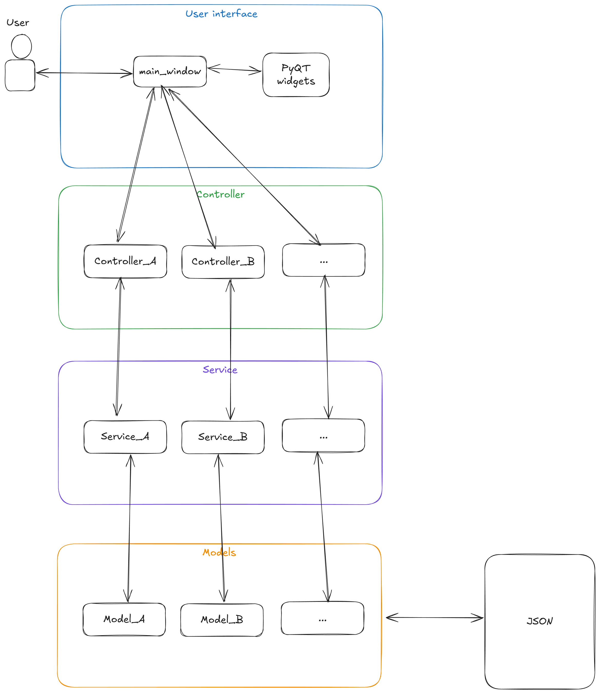
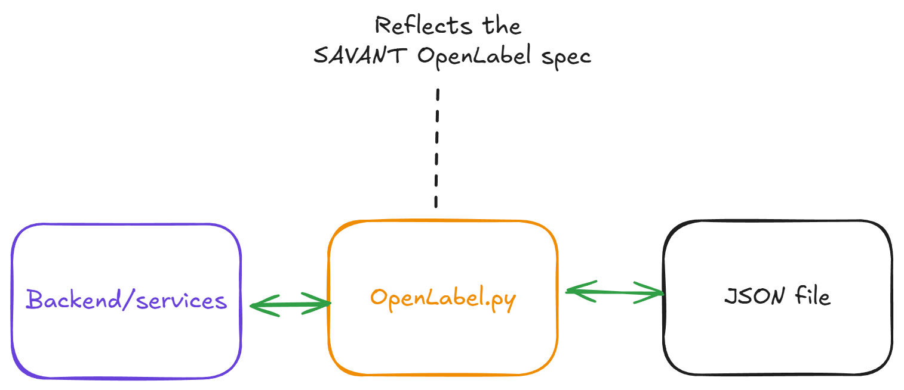

## Installation & Setup

```bash
# Install uv if not already present
curl -LsSf https://astral.sh/uv/install.sh | sh

# Clone repository
git clone git@github.com:fwrise/SAVANT.git
cd SAVANT/edit

# Create the virtual environment and install dependencies
uv sync --all-groups
```

## Testing

Run tests using uv:

```bash
# Run all tests
uv run pytest

# Run specific test module with verbose output
uv run pytest edit/tests/unit/models/test_example_model.py -v

# Install test dependencies (if not already synced with --all-groups)
uv sync --group dev
```

## Running the Application
Run the following in the `edit/src/edit` directory:
```bash
uv run python -m edit.main
```

Run linter:
```bash
uv run flake8
```

Run code formatter:
```bash
uv run black
```

## Architecture


The layers in the architecture diagram above represent the following:
- User interface layer: Handles presentation of data and user interactions.
- Controller layer: Fosters communication between the user interface and business logic.
- Service layer: Contains the business logic of Savant, and calls relevant models
- Models: Handle specific data such as bounding boxes. The Model layer should reflect the json config,
- JSON config: Defines the configuration and outcome of the auto-labelling phase.


The data model found in `OpenLabel.py` represents the SAVANT open label specification. This allows
the backend to utilize the model as a middle man, such that it can read and edit the output of the
Markit tool.