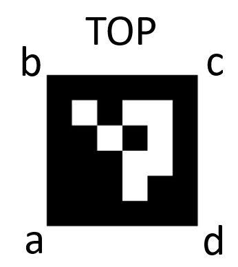

# Markit


**Multi-engine object detection and tracking with OpenLabel output**

Markit is a command-line tool for detecting and tracking objects using oriented bounding boxes (OBB), the default YOLO model is tuned for drone footage of road traffic. It combines multiple detection engines, resolves conflicts between them, and exports results in an ASAM OpenLabel JSON compatible format (the tool supports a subset of OpenLabel).

## Features

- **Multi-Engine Detection** - YOLO OBB, optical flow, and ArUco marker detection
- **VLM Scene Analysis** - Automatic scenario tagging using Vision Language Models (BSI PAS-1883 ODD taxonomy)
- **Conflict Resolution** - IoU-based merging when engines detect the same object
- **Oriented Bounding Boxes** - Proper rotation handling with continuous angle tracking
- **OpenLabel Export** - Schema-validated JSON output with per-frame timestamps and optional drone stream metadata
- **Postprocessing Pipeline** - Gap filling, duplicate removal, rotation smoothing, static object handling
- **Provenance Tracking** - W3C PROV-JSON format via dataprov
- **Video Rendering** - Optional annotated output video with drawn detections
- **Drone Info** - Optionally populate a `streams` block from a DJI flight record for richer metadata

## Contents

- [Installation](#installation)
- [Quick Start](#quick-start)
- [Detection Engines](#detection-engines)
- [Postprocessing](#postprocessing)
- [VLM Scene Analysis](#vlm-scene-analysis)
- [Output Format](#output-format)
- [ArUco Markers](#aruco-markers)
- [Configuration Reference](#configuration-reference)
- [Testing](#testing)
- [Coordinate Conventions](#coordinate-conventions)

## Installation

Markit is part of the SAVANT repository. Install from the repository root:

```bash
# Clone and install with uv (recommended)
git clone git@github.com:RI-SE/SAVANT.git
cd SAVANT
uv sync

# Or with pip
pip install -e .
```

Verify installation:

```bash
markit --help
```

### Dependencies

- Python >= 3.10
- ultralytics (YOLO OBB models)
- opencv-contrib-python >= 4.5.0
- numpy
- lap (tracking)
- rdflib (ontology parsing)
- dataprov (provenance tracking)

## Quick Start

Basic usage with YOLO detection:

```bash
markit --input video.mp4 --output_json output.json
```

With custom weights and output video:

```bash
markit --input video.mp4 --output_json output.json \
       --weights custom_model.pt --output_video annotated.mp4
```

With postprocessing enabled:

```bash
markit --input video.mp4 --output_json output.json --housekeeping
```

Using uv from repository root:

```bash
uv run markit --input markit/video.mp4 --output_json output.json
```

## Detection Engines

Markit supports three detection engines that can be used individually or combined.

### YOLO OBB Engine (default)

Uses Ultralytics YOLO with oriented bounding box support. Provides object classification and tracking.

```bash
markit --detection-method yolo --weights model.pt --input video.mp4 --output_json output.json
```

### Optical Flow Engine

Motion-based detection using background subtraction and optical flow. Useful for detecting moving objects without a trained model.

```bash
markit --detection-method optical_flow --input video.mp4 --output_json output.json \
       --motion-threshold 0.5 --min-object-area 200
```

### Combined Detection

Run both engines with IoU-based conflict resolution. YOLO takes precedence for overlapping detections.

```bash
markit --detection-method both --weights model.pt --input video.mp4 --output_json output.json \
       --iou-threshold 0.3
```

Disable conflict resolution to keep all detections:

```bash
markit --detection-method both --weights model.pt --input video.mp4 --output_json output.json \
       --disable-conflict-resolution
```

### ArUco Marker Detection

Enabled when providing a CSV file with marker positions:

```bash
markit --input video.mp4 --output_json output.json \
       --aruco-csv markers.csv --aruco-dict DICT_4X4_50
```

See [ArUco Markers](#aruco-markers) for CSV format details.

## Postprocessing

Enable all postprocessing passes with `--housekeeping`:

```bash
markit --input video.mp4 --output_json output.json --housekeeping
```

### Available Passes

| Pass | Description |
|------|-------------|
| Gap Detection | Identifies gaps in object tracking sequences |
| Gap Filling | Interpolates detections across small gaps |
| Duplicate Removal | Removes overlapping detections using IoU thresholds |
| First Detection Refinement | Refines initial detection angles using lookahead |
| Bbox Smoothing | Applies temporal smoothing to position and size (reduces jitter) |
| Rotation Adjustment | Smooths rotation using movement direction |
| Sudden Detection | Flags objects appearing/disappearing far from frame edges |
| Frame Interval | Calculates frame intervals for each object |
| Static Object Removal | Removes or marks objects that don't move |

For detailed algorithm descriptions and tuning guidelines, see [Postprocessing Technical Reference](docs/postprocessing.md).

### Postprocessing Options

```bash
markit --input video.mp4 --output_json output.json --housekeeping \
       --duplicate-avg-iou 0.7 \
       --duplicate-min-iou 0.3 \
       --rotation-threshold 0.1 \
       --min-movement-pixels 5.0 \
       --rotation-smoothing 0.5 \
       --edge-distance 200 \
       --static-threshold 20 \
       --static-mark  # Mark instead of remove
```

## VLM Scene Analysis

Markit can analyze video frames using a Vision Language Model (VLM) to automatically tag scenarios with environmental metadata. The analysis follows the BSI PAS-1883 Operational Design Domain (ODD) taxonomy.

### Features

- **Weather conditions** - precipitation, visibility, time of day, cloud cover
- **Road infrastructure** - road type, surface condition, lane count, geometry
- **Traffic conditions** - density, flow, presence of pedestrians/cyclists
- **Junction information** - type, signalization, crossings
- **Structures** - bridges, tunnels, barriers, street lighting

### Prerequisites

VLM analysis requires a running vLLM server with a vision-capable model:

```bash
# Example: Start vLLM with Qwen3-VL
vllm serve Qwen/Qwen3-VL-30B-A3B-Instruct-FP8 \
    --max-model-len 8192 \
    --gpu-memory-utilization 0.9
```

Any OpenAI-compatible vision model API can be used. The server must be accessible at the configured URL.

### Usage

Enable VLM analysis with the `--vlm` flag:

```bash
markit --input video.mp4 --output_json output.json --vlm
```

With custom model and server:

```bash
markit --input video.mp4 --output_json output.json \
       --vlm \
       --vlm-model "Qwen/Qwen3-VL-30B-A3B-Instruct-FP8" \
       --vlm-url "http://localhost:8000"
```

Control frame sampling:

```bash
markit --input video.mp4 --output_json output.json \
       --vlm \
       --vlm-interval 60 \      # Analyze every 60th frame
       --vlm-max-frames 10      # Analyze at most 10 frames
```

Reduce VRAM usage by downscaling frames:

```bash
markit --input video.mp4 --output_json output.json \
       --vlm \
       --vlm-max-resolution 1080   # Resize 4K frames to 1080p before VLM analysis
```

Add delay between requests (useful for memory-constrained servers):

```bash
markit --input video.mp4 --output_json output.json \
       --vlm \
       --vlm-max-resolution 720 \
       --vlm-delay 0.5             # Wait 0.5s between requests
```

Request rationale explanations for weather classifications:

```bash
markit --input video.mp4 --output_json output.json \
       --vlm \
       --vlm-rationale             # Include rationale for weather fields
```

With `--vlm-rationale`, the VLM provides brief explanations for weather classifications (e.g., "White particles visible throughout frame suggest active snowfall"). This increases token usage but improves explainability and helps identify classification errors. Rationales are stored as `*_rationale` fields in the weather tag.

### VLM Configuration Options

| Argument | Default | Description |
|----------|---------|-------------|
| `--vlm` | false | Enable VLM scene analysis |
| `--vlm-model` | `llama-3.2-11b-vision-instruct` | Model name on the vLLM server |
| `--vlm-url` | `http://localhost:8000` | vLLM API base URL |
| `--vlm-api-key` | - | API key for authentication (if required) |
| `--vlm-sampling` | `uniform` | Sampling strategy: `uniform`, `scene_change`, `keyframes` |
| `--vlm-interval` | `30` | Frame interval for uniform sampling |
| `--vlm-max-frames` | `20` | Maximum number of frames to analyze |
| `--vlm-timeout` | `120` | Request timeout in seconds |
| `--vlm-prompts` | - | Path to custom prompts JSON file |
| `--vlm-max-resolution` | - | Max frame height in pixels (e.g., 1080). Reduces VRAM usage |
| `--vlm-delay` | `0` | Delay between VLM requests in seconds |
| `--vlm-rationale` | `false` | Request rationale explanations for weather fields |

### Output

VLM analysis adds two sections to the OpenLabel output:

**Contexts** - Time-bounded scene conditions with frame intervals:

```json
"contexts": {
  "0": {
    "name": "weather_conditions",
    "type": "WeatherContext",
    "frame_intervals": [{"frame_start": 0, "frame_end": 299}],
    "context_data": {
      "text": [
        {"name": "precipitation", "val": "none"},
        {"name": "time_of_day", "val": "day"}
      ],
      "vec": [
        {"name": "precipitation_confidence", "val": [0.95]},
        {"name": "precipitation_annotator", "val": ["markit_vlm"]},
        {"name": "time_of_day_confidence", "val": [0.98]},
        {"name": "time_of_day_annotator", "val": ["markit_vlm"]}
      ]
    }
  }
}
```

**Tags** - Scenario-level metadata (aggregated across all analyzed frames):

```json
"tags": {
  "0": {
    "name": "weather_conditions",
    "type": "WeatherTag",
    "tag_data": {
      "text": [
        {"name": "precipitation", "val": "none"},
        {"name": "time_of_day", "val": "day"}
      ],
      "vec": [
        {"name": "precipitation_confidence", "val": [0.95]},
        {"name": "precipitation_annotator", "val": ["markit_vlm"]},
        {"name": "time_of_day_confidence", "val": [0.98]},
        {"name": "time_of_day_annotator", "val": ["markit_vlm"]}
      ]
    }
  }
}
```

Each VLM-generated field includes:
- `*_confidence` - VLM's certainty for this classification (0.0-1.0)
- `*_annotator` - Source identifier (`markit_vlm`)
- `*_rationale` - Optional explanation when `--vlm-rationale` is enabled

### Custom Prompts

Override the default prompts by providing a JSON file:

```bash
markit --input video.mp4 --output_json output.json \
       --vlm --vlm-prompts custom_prompts.json
```

See `markit/markitlib/vlm/prompts/default_prompts.json` for the expected format. The file must contain a `comprehensive` prompt with `system`, `user_template`, and optionally `response_schema` keys.

## Output Format

Markit exports detections in OpenLabel (subset) JSON format, including information on annotator and confidence in annotation accuracy. Each frame entry includes a `frame_properties.timestamp` (starting at `"00:00:00.000000"` for frame 0) derived from the video FPS, so downstream tools can work with video time rather than just frame numbers.

### JSON Structure

```json
{
  "openlabel": {
    "metadata": {
      "schema_version": "1.1",
      "tagged_file": "Saro_roundabout.mp4",
      "annotator": "SAVANT Markit 2.0.3",
      "name": "SAVANT Markit 2.0.3 Analysis",
      "comment": "Multi-engine object detection and tracking analysis of Saro_roundabout.mp4",
      "tags": [
        "object_detection",
        "tracking"
      ]
    },
    "ontologies": {
      "0": "https://ri-se.github.io/SAVANT/ontology/savant#",
      "1": "https://github.com/RI-SE/SAVANT/tree/main/ontology/savant-scenario#"
    },
    "streams": {
      "drone_camera": {
        "type": "camera",
        "description": "Mavic3Pro standard lens",
        "uri": "Saro_roundabout.mp4",
        "stream_properties": {
          "sync": { "frame_rate": 25.0 },
          "drone_type": "Mavic3Pro",
          "lens_type": "standard",
          "recording_start": "2025-11-18T22:21:57.044Z",
          "recording_end": "2025-11-18T22:35:13.611Z",
          "position": {
            "latitude_mean_deg": 57.7425,
            "longitude_mean_deg": 12.8946,
            "altitude_msl_mean_m": 434.59,
            "height_agl_mean_m": 119.66
          },
          "gimbal_pitch_mean_deg": -83.1
        }
      }
    },
    "objects": {
      "1": {
        "name": "Object-1",
        "type": "Car",
        "ontology_uid": "0",
        "frame_intervals": [
          {
            "frame_start": 0,
            "frame_end": 299
          }
        ]
      }
    },
    "frames": {
      "0": {
        "frame_properties": {
          "timestamp": "00:00:00.000000"
        },
        "objects": {
          "1": {
            "object_data": {
              "rbbox": [
                {
                  "name": "shape",
                  "val": [
                    3154,
                    1876,
                    144,
                    71,
                    3.698
                  ]
                }
              ],
              "vec": [
                {
                  "name": "annotator",
                  "val": [
                    "markit_yolo"
                  ]
                },
                {
                  "name": "confidence",
                  "val": [
                    0.8921
                  ]
                }
              ]
            }
          }
        }
      }
    }
  }
}
```

The `streams` block is optional and only written when `--drone-info` is provided (see [Configuration Reference](#configuration-reference)).

### Annotator and Confidence

Each detection includes annotator identification and a confidence score in the vec format. This supports multi-annotator tracking where human edits preserve the original detection history.

| Annotator | Confidence Meaning |
|-----------|-------------------|
| `markit_yolo` | YOLO model detection confidence (0.0–1.0) |
| `markit_vlm` | VLM analysis confidence (0.0–1.0) |
| Human | Always 1.0 (ground truth by convention) |

See [Schema documentation](../schema/README.md#annotator-and-confidence-fields) for full details on multi-annotator tracking.

### Output Video

Generate an annotated video with drawn bounding boxes:

```bash
markit --input video.mp4 --output_json output.json --output_video annotated.mp4
```

### Provenance Tracking

Track processing provenance in W3C PROV-JSON format:

```bash
markit --input video.mp4 --output_json output.json --provenance provenance.json
```

The provenance file records inputs, outputs, parameters, and processing steps.

## ArUco Markers

ArUco markers can be used as ground control points with known GPS positions. When detected, markers are added to the OpenLabel output with their associated coordinates (see TestVids/Saro_roundabout for example).

### CSV Format

```csv
ID,long,lat,alt,horiz SD,vert SD,Location name
aruco_24a,47.3769,8.5417,410,0.02,0.03,Gothenburg
aruco_24c,47.3771,8.5419,410,0.02,0.03,Gothenburg
```

| Column | Description |
|--------|-------------|
| ID | Marker identifier in format `aruco_[num][a-d]` where letter indicates corner |
| long | Longitude of the marker corner |
| lat | Latitude of the marker corner |
| alt | Altitude in meters |
| horiz SD | Horizontal standard deviation (use `inf` if unknown) |
| vert SD | Vertical standard deviation (use `inf` if unknown) |
| Location name | Human-readable location identifier |

### Corner Notation

Each ArUco marker has 4 corners labeled a, b, c, d:



Marker position is included in the OpenLabel output as objects with additional object_data including longitude, latitude, and altitude from the corner(s) where position is measured (from the csv file):

```json
     "2000017": {
        "name": "GbgSaroRound_17",
        "type": "ArUco",
        "ontology_uid": "0",
        "object_data": {
          "vec": [
            {
              "name": "arucoID",
              "val": [
                "17a",
                "17c"
              ]
            },
            {
              "name": "long",
              "val": [
                "12.00977788073061",
                "12.009746301733916"
              ]
            },
            {
              "name": "lat",
              "val": [
                "57.48451372894236",
                "57.484504456642185"
              ]
            },
            {
              "name": "alt",
              "val": [
                "72.75258941650391",
                "72.54821319580078"
              ]
            },
            {
              "name": "description",
              "val": "GbgSaroRound"
            }
          ]
        }
      }
```


### Usage

```bash
markit --input video.mp4 --output_json output.json \
       --aruco-csv markers.csv --aruco-dict DICT_4X4_50
```

Supported ArUco dictionaries: `DICT_4X4_50`, `DICT_4X4_100`, `DICT_4X4_250`, `DICT_4X4_1000`, `DICT_5X5_50`, etc., where default is DICT_4X4_50.

## Configuration Reference

### Required Arguments

| Argument | Description |
|----------|-------------|
| `--input` | Path to input video file |
| `--output_json` | Path to output OpenLabel JSON file |

### Optional Arguments

| Argument | Default | Description |
|----------|---------|-------------|
| `--weights` | `markit_yolo.pt` | YOLO weights file (.pt) |
| `--schema` | `../schema/savant_openlabel_subset.schema.json` | OpenLabel JSON schema |
| `--ontology` | `../ontology/savant.ttl` | SAVANT ontology file |
| `--ontology-uri` | extracted from file | Ontology URI for OpenLabel output |
| `--output_video` | - | Output annotated video path |
| `--aruco-csv` | - | CSV with ArUco marker positions |
| `--visual-markers` | - | CSV with visual marker positions (same format as ArUco) |
| `--provenance` | - | Provenance chain file path |
| `--drone-info` | - | Path to a DJI `FlightRecord*.video_stats.json` file; adds a `streams` block with camera and flight metadata to the OpenLabel output |

### Detection Options

| Argument | Default | Description |
|----------|---------|-------------|
| `--detection-method` | `yolo` | `yolo`, `optical_flow`, or `both` |
| `--motion-threshold` | `0.5` | Optical flow motion threshold |
| `--min-object-area` | `200` | Minimum object area (pixels²) |
| `--aruco-dict` | `DICT_4X4_50` | ArUco dictionary type |

### Conflict Resolution

| Argument | Default | Description |
|----------|---------|-------------|
| `--iou-threshold` | `0.3` | IoU threshold for conflict detection |
| `--verbose-conflicts` | false | Enable verbose conflict logging |
| `--disable-conflict-resolution` | false | Keep all detections without merging |

### Postprocessing

| Argument | Default | Description |
|----------|---------|-------------|
| `--housekeeping` | false | Enable all postprocessing passes |
| `--duplicate-avg-iou` | `0.7` | Average IoU for duplicate detection |
| `--duplicate-min-iou` | `0.3` | Minimum IoU for duplicate detection |
| `--rotation-threshold` | `0.1` | Rotation adjustment threshold (radians) |
| `--min-movement-pixels` | `5.0` | Minimum movement for rotation calculation |
| `--rotation-smoothing` | `0.5` | Rotation temporal smoothing factor (0-1) |
| `--edge-distance` | `200` | Edge distance for sudden detection (pixels) |
| `--static-threshold` | `20` | Static object movement threshold (pixels) |
| `--static-mark` | false | Mark static objects instead of removing |

### VLM Scene Analysis

| Argument | Default | Description |
|----------|---------|-------------|
| `--vlm` | false | Enable VLM scene analysis |
| `--vlm-model` | `llama-3.2-11b-vision-instruct` | Model name on the vLLM server |
| `--vlm-url` | `http://localhost:8000` | vLLM API base URL |
| `--vlm-api-key` | - | API key for authentication |
| `--vlm-sampling` | `uniform` | Frame sampling strategy |
| `--vlm-interval` | `30` | Frame interval for uniform sampling |
| `--vlm-max-frames` | `20` | Maximum frames to analyze |
| `--vlm-timeout` | `120` | Request timeout (seconds) |
| `--vlm-prompts` | - | Custom prompts JSON file |
| `--vlm-max-resolution` | - | Max frame height (pixels) |
| `--vlm-delay` | `0` | Delay between requests (seconds) |
| `--vlm-rationale` | `false` | Request rationale explanations for weather fields |

### Logging

| Argument | Description |
|----------|-------------|
| `--verbose` | Enable detailed angle and detection logging |
| `--version` | Show version and exit |

## Testing

Run the test suite from the markit directory:

```bash
# All tests
pytest

# Unit tests only (fast)
pytest -m "not integration"

# Integration tests only
pytest -m integration

# With coverage report
pytest --cov=markitlib --cov-report=html

# Specific test file
pytest tests/test_geometry.py

# Verbose output
pytest -vv -s
```

### Test Structure

```
tests/
├── conftest.py              # Shared fixtures
├── test_geometry.py         # IoU and polygon operations
├── test_config.py           # Configuration and ontology
├── test_postprocessing.py   # Postprocessing passes
├── test_openlabel.py        # JSON generation and validation
├── test_integration.py      # End-to-end tests
└── fixtures/                # Test data
    ├── Kraklanda_short.mp4
    └── best.pt
```

## Coordinate Conventions

### Bounding Box Representation

Markit uses oriented bounding boxes represented as:
- **OBB corners**: 4 points `[[x1,y1], [x2,y2], [x3,y3], [x4,y4]]`
- **XYWHR format**: center (x, y), dimensions (width, height), rotation (r) in radians

### Angle Convention

- Internal storage uses continuous unbounded angles to handle YOLO's π/2 ambiguity
- Output angles are normalized to `[0, 2π)` range
- Positive x-axis = 0 radians, rotation increases counterclockwise
- Semantic dimensions: width is always the longer axis

### Image Coordinates

- Origin (0, 0) at top-left
- x increases rightward
- y increases downward

## License

SAVANT is licensed under the GNU Affero General Public License v3.0 (AGPL-3.0).
