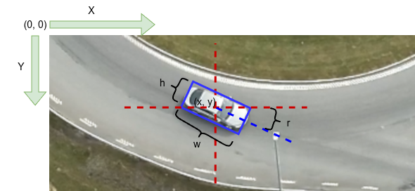

# SAVANT OpenLabel Schema

This directory contains the JSON schema for SAVANT's OpenLabel subset.

## Overview

SAVANT uses a subset of the [ASAM OpenLabel](https://www.asam.net/standards/detail/openlabel/) format for video annotation data. This schema defines the structure for storing object detections, tracking data, and behavioural annotations.

**Schema Version:** 1.1
**Format:** JSON Schema

## Structure

### Root

```json
{
  "openlabel": {
    "metadata": { ... },
    "ontologies": { ... },
    "objects": { ... },
    "actions": { ... },
    "frames": { ... }
  }
}
```

### Metadata

Schema version is required. We use `tagged_file` for the source video and `annotator` for person(s) or tool(s) annotating.

```json
"metadata": {
    "schema_version": "1.1.0",
    "tagged_file": "filename.mp4",
    "annotator": "SAVANT markit v0.3.2"
}
```

### Ontologies

References to ontology definitions. Each ontology has a unique UID.

```json
"ontologies": {
    "0": "https://ri-se.github.io/SAVANT/ontology/1.3.1.ttl"
}
```

### Objects

Static information about objects in the video. Contains type, name, and optionally frame intervals where the object appears.

```json
"objects": {
    "0": {
        "name": "Car-0",
        "type": "Car",
        "ontology_uid": "0",
        "frame_intervals": [{ "frame_start": 0, "frame_end": 10 }]
    },
    "1": {
        "name": "Person-1",
        "type": "Pedestrian",
        "ontology_uid": "0"
    }
}
```

#### ArUco Marker Objects

ArUco markers include GPS coordinates for one or more corner(s):

```json
"2": {
    "name": "GbgSaroRound_24",
    "type": "ArUco",
    "ontology_uid": "0",
    "object_data": {
        "vec": [
            { "name": "arucoID", "val": ["24a", "24c"] },
            { "name": "long", "val": ["12.010028", "12.010052"] },
            { "name": "lat", "val": ["57.484172", "57.484185"] },
            { "name": "alt", "val": ["75.032", "75.017"] },
            { "name": "description", "val": "GbgSaroRound" }
        ]
    }
}
```

### Actions

Semantically meaningful acts occurring over frame intervals (e.g., overtake, lane change).

```json
"actions": {
    "0": {
        "name": "Action-0",
        "type": "Overtake",
        "ontology_uid": "0",
        "frame_intervals": [{ "frame_start": 5, "frame_end": 8 }]
    }
}
```

### Frames

Dynamic per-frame information, primarily bounding boxes for tracked objects.

```json
"frames": {
    "0": {
        "objects": {
            "0": {
                "object_data": {
                    "rbbox": [{ "name": "shape", "val": [x, y, width, height, angle] }],
                    "vec": [
                        { "name": "annotator", "val": ["SAVANT markit v0.3.2"] },
                        { "name": "confidence", "val": [0.87] }
                    ]
                }
            }
        }
    }
}
```

## Annotator and Confidence Fields

SAVANT uses a multi-annotator tracking system that preserves the edit history for both bounding boxes and VLM tags. The `annotator` and `confidence` fields use the vec (list) format to support this history.

### Vec Format Structure

```json
"vec": [
  { "name": "annotator", "val": ["human_user", "markit_yolo"] },
  { "name": "confidence", "val": [1.0, 0.89] }
]
```

- The **first element** is the most recent annotator/confidence
- **Later elements** preserve the original annotation history
- When a human edits an annotation, their ID is prepended with confidence 1.0

### Confidence Values by Annotator Type

| Annotator | Confidence Range | Meaning |
|-----------|-----------------|---------|
| `markit_yolo` | 0.0–1.0 | YOLO model detection confidence. Higher = model more certain about detection. Typical values: 0.7–0.95 |
| `markit_vlm` | 0.0–1.0 | VLM self-reported confidence in its scene analysis. Aggregated across analyzed frames |
| Human (any name) | Always 1.0 | Human review/edit. By convention, human annotations are considered ground truth |

### Example: Bounding Box Edit History

Original YOLO detection:
```json
"vec": [
  { "name": "annotator", "val": ["markit_yolo"] },
  { "name": "confidence", "val": [0.87] }
]
```

After human correction:
```json
"vec": [
  { "name": "annotator", "val": ["alice", "markit_yolo"] },
  { "name": "confidence", "val": [1.0, 0.87] }
]
```

### Example: VLM Tag Edit History

Original VLM analysis:
```json
"tag_data": {
  "text": [{ "name": "precipitation", "val": "none" }],
  "vec": [
    { "name": "annotator", "val": ["markit_vlm"] },
    { "name": "confidence", "val": [0.92] }
  ]
}
```

After human edit (changed precipitation value):
```json
"tag_data": {
  "text": [{ "name": "precipitation", "val": "light_rain" }],
  "vec": [
    { "name": "annotator", "val": ["bob", "markit_vlm"] },
    { "name": "confidence", "val": [1.0, 0.92] }
  ]
}
```

### Usage in Savant Edit

The confidence value determines how annotations appear in the editor:
- **Error range** (default <0.5): Red markers on seek bar, red overlay indicators
- **Warning range** (default 0.5–0.8): Amber markers and indicators
- **Normal range** (default >0.8): No special indicators

When reviewing low-confidence detections, use "Mark as resolved" to set confidence to 1.0 and prepend your annotator ID.

## Rotated Bounding Box (rbbox)

SAVANT uses rotated bounding boxes for all dynamic objects:

| Parameter | Description |
|-----------|-------------|
| x | Center x-coordinate (pixels) |
| y | Center y-coordinate (pixels) |
| width | Box width (pixels) |
| height | Box height (pixels) |
| angle | Rotation angle (radians, 0 to 2π) |



## Validation

Validate OpenLabel files against the schema:

```python
import json
import jsonschema

with open("schema/savant_openlabel_subset.schema.json") as f:
    schema = json.load(f)

with open("output.json") as f:
    data = json.load(f)

jsonschema.validate(data, schema)
```

Or using markit with schema validation:

```bash
markit --input video.mp4 --output_json output.json \
       --schema schema/savant_openlabel_subset.schema.json
```

## References

- [ASAM OpenLabel](https://www.asam.net/standards/detail/openlabel/)
- [SAVANT Ontology](../ontology/README.md)
- [markit Documentation](../markit/README.md)
